<h1 align="center">Computer Vision Projects</h1>

    </img>
    </img>

A collection of Computer Vision related projects created primarily using OpenCV

***

## List of projects in this repository:
1. [Face Detection with OpenCV & Deep Learning](#face-detection-with-opencv--deep-learning)
2. [Face Blurring](#face-blurring)
3. [Document Scanner](#document-scanner)
4. [OMR Test Grader](#omr-test-grader)
5. [Ball Tracker](#ball-tracker)
6. [Object Size Measurement](#object-size-measurement)
7. [Facial Landmarks Detector](#facial-landmarks-detector)
8. [Eye Blink Detector](#eye-blink-detector)
9. [Drowsiness Detector](#drowsiness-detector)
10. [Image Classification](#image-classification)

## Face Detection with OpenCV & Deep Learning

__Overview:__

OpenCV ships out-of-the-box with pre-trained [Haar cascades](https://docs.opencv.org/3.4/db/d28/tutorial_cascade_classifier.html) that can be used for face detection in general. But for this app, we use a pre-trained __deep learning-based face detector model__ (built using Caffe).

For using OpenCV's Deep Neuram Network [`dnn`] module with Caffe Models we need 2 file:
- `.prototxt` file defines the model architecture
- `.caffemodel` contains the weights for the actual layers

These files can be found [here](https://github.com/tezansahu/Computer_Vision_Projects/tree/master/1.%20Face%20Detection%20with%20OpenCV%20and%20Deep%20Learning/caffe-model)

__Code:__

- [Code for detecting faces in a picture](1_Face_Detection_with_OpenCV_and_Deep_Learning/detect_faces.py)
- [Code for detecting faces in a video](1_Face_Detection_with_OpenCV_and_Deep_Learning/detect_faces_video.py)

__Results:__

## Face Blurring

__Overview:__

For this project, we use the same Caffe model for detecting faces as done in the previous project & once the Region of Interest (ROI) is detected, we perform a blur operation on it & superimpose it on the original image.

We provide an option to perform 2 types of blurring (while running the script):
- Gaussian Blur (the size of Gaussian kernel can be specified)
- Pixelated Blur (the size of pixelated boxes can be specified)

__Code:__

[Code for blurring faces in an image](2_Face_Blurring/face_blur.py)

__Results:__

- __Gaussian Blur:__

  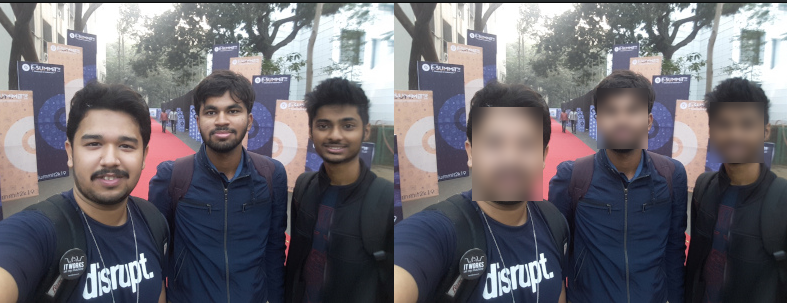
  

- __Pixelated Blur:__

  
  

## Document Scanner

This project intends to develop a document scanner (much like Camscanner or Adobe Scanner), which, given an image, __extracts the contours of the document__ & performs a __perspective transform__ to obtain the top-down view of the document.

To perform the perspective transform, we use the utility functions defined [here](3_Document_Scanner/pyimagesearch) 

A major assumption in this project is: _The largest contour in the image with exactly four points is our piece of paper to be scanned._

__Code:__

[Code for scanning document present in an image](3_Document_Scanner/scanner.py)

__Results:__

| Image | Detected Contour | Scanned Document |
| :---: | :---: | :---: |
| | 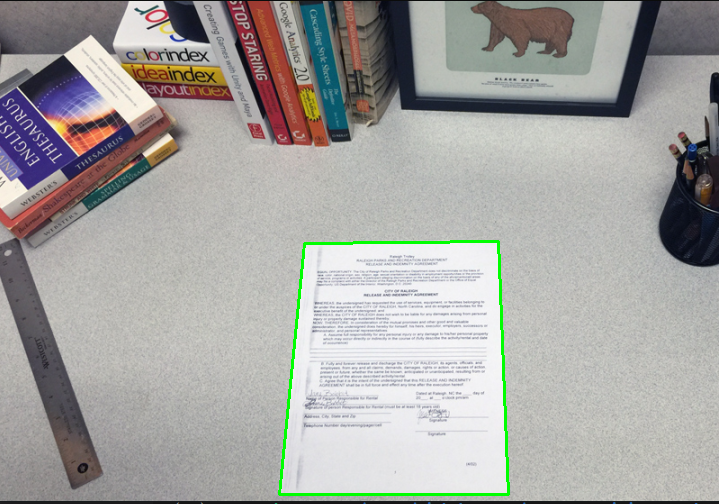 |  |
|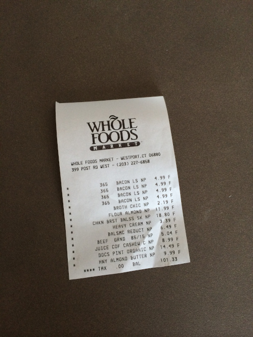 | 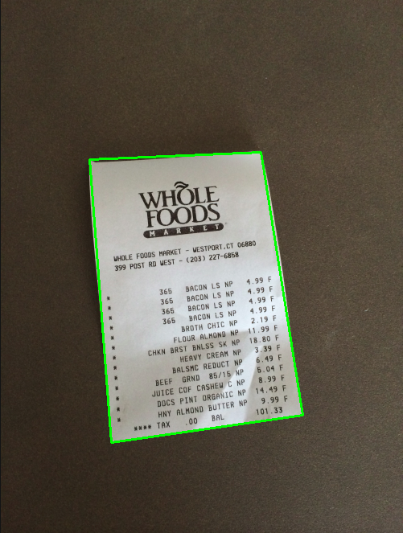 | 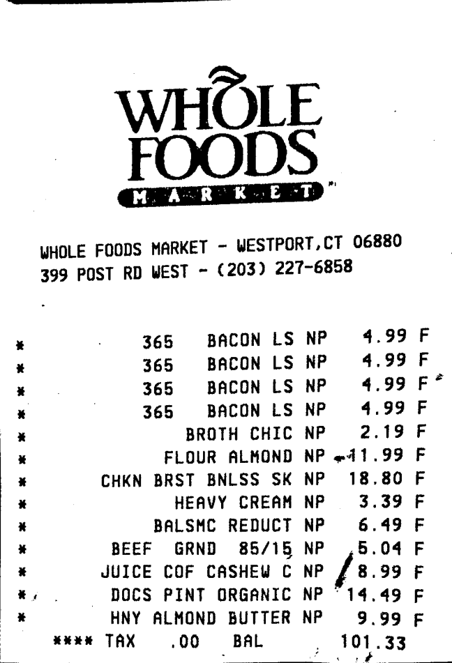 |
|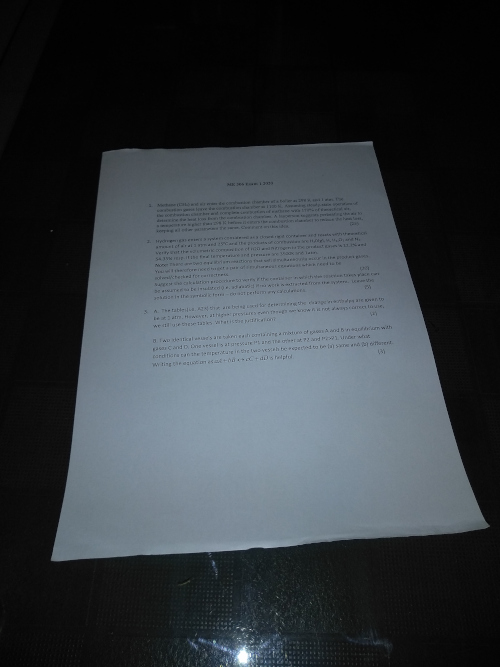 |  | 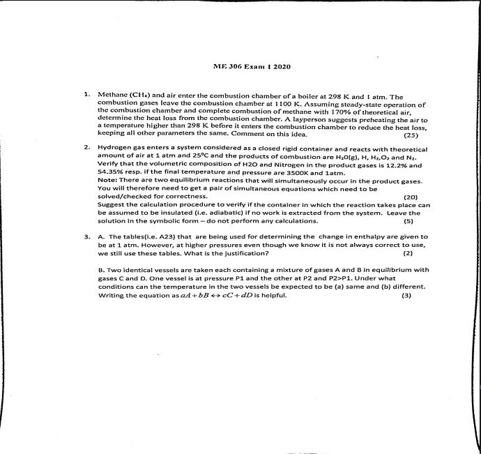 |

## OMR Test Grader

This project develops upon the concepts used in the Document Scanner where the scanned document is a filled OMR Sheet ready to be graded.

The document is first extracted from the image by the use of perspective transform, followed by extraction of all the bubbles & sorting them per questions. The marked bubble is identified by thresholding & finding the bubble with maximum pixels filled.

Grading is done using the following scheme:
- Correct: +1
- Incorrect: -0.25
- Unattempted: 0

__Code:__

[Code for the OMR Test Grader](4_OMR_Test_Grader/test_grader.py)

__Results:__
||||
| :---: | :---: | :---: |
|  | 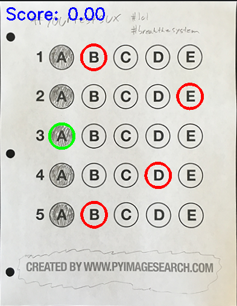 |  |
| 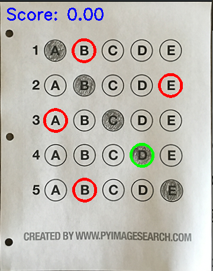 |  |  |

## Ball Tracker

The goal of this project is to detect the presence of a colored ball using computer vision techniques & track the ball as it moves around in the video frames, drawing its previous positions as it moves.

Each frame of the video is first converted to [HSV Color Space](). The range of colors within which the ball appears is also set in HSV using [this  range-detector script](5_Ball_Tracking/range-detector.py). The ball is identified using contours & its centroid is stored in a buffer (used to show the trail of movement).

__Code:__
- [Code for the range detector in HSV](5_Ball_Tracking/range-detector.py)
- [Code for the ball tracker](5_Ball_Tracking/tracker.py)

__Results:__

_Here, the range of HSV values for the violet ball is:_
- _colorLower = (125, 65, 41)_
- _colorUpper = (159, 255, 255)_

## Object Size Measurement

In this project, we try to calculate the size of objects present in the image using an object with a known dimension to _calibrate_ the app using the __pixels per metric ratio__ (object_width / known_width). 

We require that this reference object is the left-most object in the image. First, we calculate the bounding boxes around the objects present in the image & then use the pixels per metric ratio & the euclidean distance between the opposite edges of the bounding boxes to obtain the estimated measurement of the object.

__Code:__

[Code for Object Size Measurement](6_Object_Size_Measurement/object_size.py)

__Results:__

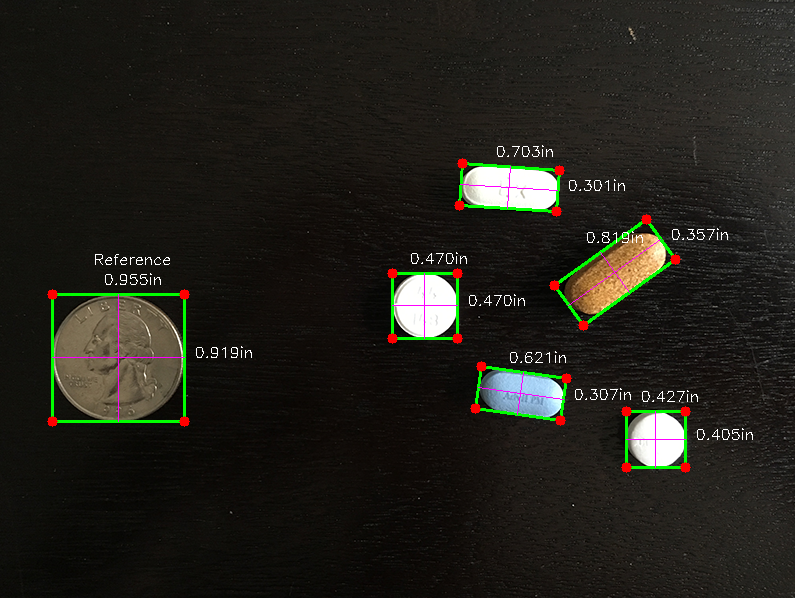

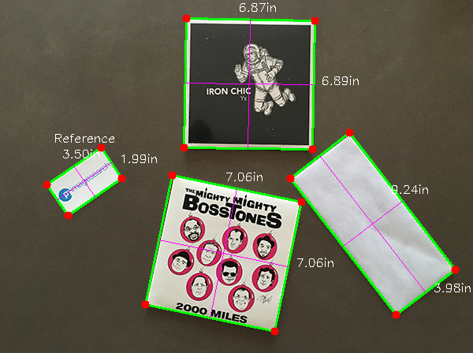

## Facial Landmarks Detector

This project focusses on obtaining the facial landmarks from the faces present in an image. These landmarks represent salient regios of a face & include: _eyes, eyebrows, nose, mouth & jawline_.

For this project, we will use the __pre-trained facial landmark detector__ inside the `dlib` library, which represent these facial landmarks using __68 (x, y)-coordinates__. It can be found [here](7_Facial_Landmarks_Detector/shape_predictor_68_face_landmarks.dat)

We first extract the Regions of Interest (ROIs), i.e. the faces from the image & then run it through the landmark detector to obtain the 68 coordinates (per face), which are later visualized.

__Code:__

[Code for Facial Landmark Detector](7_Facial_Landmarks_Detector/landmarks.py)

__Results:__

## Eye Blink Detector

The Facial Landmarks Detector developed previously can be used for several intersting applications. One of them is explored here. This project leverages the coordinates obtained by the landmarks detector by using them to count the _blinks_ of a person in a video.

A novel method of detecting blinks using the __eye aspect ratio (EAR)__ was introduced in [this paper](http://vision.fe.uni-lj.si/cvww2016/proceedings/papers/05.pdf). Intuitively, EAR is approximately constant while the eye is open, but will rapidly fall to zero when a blink is taking place.

This concept is used to calculate the EAR in each frame of the video & check if the average EAR of the left & right eyes falls below a threshold for a certain number of frames. This indicates a blink & increments the counter.

Similarly, the EAR of a single eye can be monitored to identify a wink.

__Code:__
- [Code for Blink Detection](8_Eye_Blink_Detector/blink_detector.py)
- [Code for Wink Detection](8_Eye_Blink_Detector/wink_detector.py)

__Result:__

## Drowsiness Detector

The same concept of EAR can be extended to build a Drowsiness Detector (which could be deployed on an RPi & installed in a car to indicate that the driver is drowsy).

Here too, the average EAR of both eyes is calculated. Once this value falls below a threshold continuously for a certain number of frames (obviously much longer than the threshold frames set for blink detection), an alarm is set off to try & awake the drowsy person in front of the camera.

__Code:__

[Code for Drowsiness Detector](9_Drowsiness_Detector/detect_drowsiness.py)

__Result:__

_The video with the sounding of the alarm on drowsiness detection can be found [here](9_Drowsiness_Detector/results/res-webcam.mp4)._

## Image Classification
The `dnn` module of OpenCV has several pre-trained models that can be used to various tasks including stuff like image classification. 

Here, we try to classify images using the GoogLeNet architecture (pre-trained on ImageNet) using the Caffe framework. This model predicts the class that the image belongs to & also shows the prediction confidence.

The `.prototxt` & `.caffemodel` files for the GoogLeNet architecture can be found [here](10_Image_Classification/caffe-models). The full list of possible labels can be found [here](10_Image_Classification/synset_words.txt).

__Code:__

[Code for Image Classifier using GoogLeNet](10_Image_Classification/img_classifier.py)

__Results:__

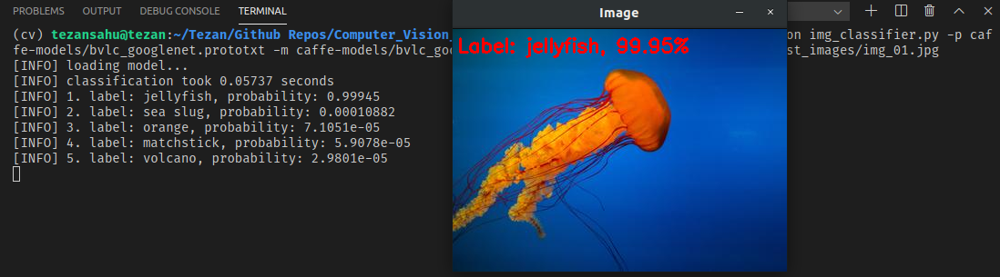

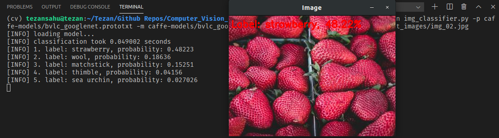

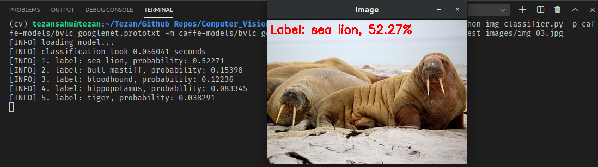

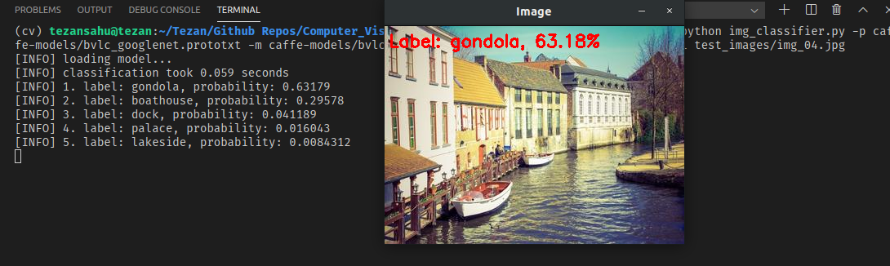

***

Created with :heart: by <a href="https://www.linkedin.com/in/tezan-sahu/">Tezan Sahu</a>

